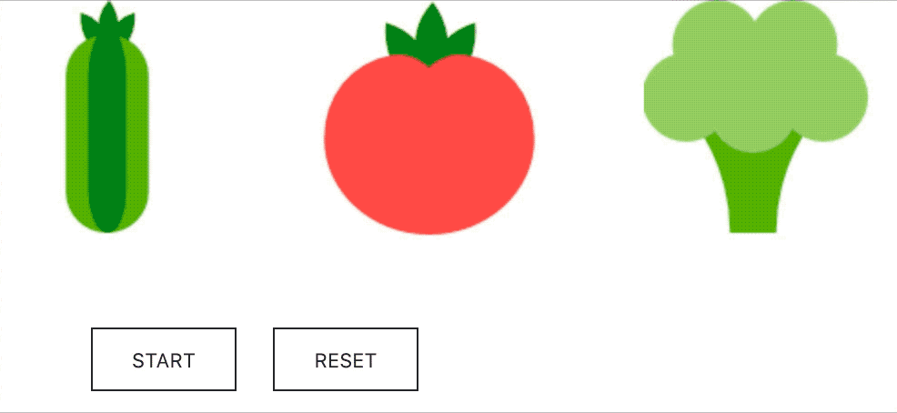

# react-rolling-item

## example



```react
<>
  <RollingItem
    on={this.state.start}
    column={3}
    backgroundImage={imageFile}
    backgroundSize="600px 564px"
    introItemInfo={{ x: -39, y: -28 }}
    itemInfo={
      [
        { x: -39, y: -217, id: 'item_1', probability: 0 },
        { x: -39, y: -406, id: 'item_2', probability: 0 },
        { x: -241, y: -28, id: 'item_3', probability: 0 },
        { x: -241, y: -217, id: 'item_4', probability: 0 },
        { x: -241, y: -406, id: 'item_5', probability: 0 },
        { x: -437, y: -28, id: 'item_6', probability: 0 },
        { x: -437, y: -217, id: 'item_7', probability: 0 },
        { x: -437, y: -406, id: 'item_8', probability: 0 },
      ]
    }
    width={177}
    height={181}
    startDelay={1000}
    fixedIds={[3, 4, 7]}
    reset={this.state.reset}
    completionAnimation={true}
    onProgress={(isProgress, result) => { console.log(result); }}
  />
  <button className="start_btn" onClick={this.onClick}>{!this.state.start ? 'START' : 'STOP'}</button>
  <button className="reset_btn" onClick={this.onClickReset}>RESET</button>
</>
```

### Props

| props               | type                                                   | descripton                                                   |
| ------------------- | ------------------------------------------------------ | ------------------------------------------------------------ |
| on                  | boolean                                                | roll start status                                            |
| column              | number                                                 | number of columns to roll                                    |
| backgroundImage     | string                                                 |                                                              |
| backgroundSize      | string                                                 |                                                              |
| itemInfo            | {id?: any, x: number, y: number, probability?: number} |                                                              |
| introItemInfo       | {x: number, y: number}                                 | intro screen before rolling                                  |
| width               | number                                                 | width of one item                                            |
| height              | number                                                 | height of one item                                           |
| fixedIds            | number[] or string[]                                   | You can define the id that will be won in advance            |
| startDelay          | number                                                 | post-start delay                                             |
| reset               | boolean                                                | random initialization of all items                           |
| completionAnimation | boolean                                                | whether you want to do an animation when the item stops (IE9 is not supported) |
| rootClassName       | string                                                 | You can set className to set a custom style on the root node |
| onProgress          | (progress: boolean, result?: any[]) => void            | A callback function of the rolling animation process         |


## supported browsers

- IE9+, Chrome, Safari, Firefox, Whale, Mobile Safari, Mobile Chrome...

## Features

- Create a roller by the number you set.
- Setting items using sprite image.
- Return items as a result of matching.
- Probability can be set.
- Added delay option before rolling start.
- Intro screen can be set.
- reset option.